## Written by Sharon Tong
_________________________

### Contact
- Slack: @Sharon on wcscusf.slack.com
- [LinkedIn](linkedin.com/in/sharon-tong)
- Email: sharont1@mail.usf.edu
### Table of Contents
1. [Prerequisites](#prereq)
2. [Summary](#summary)
3. [Installing PFsense](#installation)
4. [Configuring PFsense](#configuration)
5. [Troubleshooting](#troubleshooting)

## Prerequisites 
1. Have your [virtual environment](https://www.virtualbox.org/wiki/Downloads) configured.
2. Have [WinRAR](https://www.win-rar.com/start.html?&L=0) installed on your computer.
3. Have your ISP gateway running (we'll be using [Ubuntu ISP](https://silexone.github.io/guides/nestor/ISPsetup.html) here).

## Summary 
PFsense is an open source firewall that is based on the FreeBSD operating system. Here, we will learn how to install and setup PFsense in a virtualization software, in this case, VirtualBox.

## Installing PFsense 
1. Go to the PFsense download page [here](https://www.pfsense.org/download/).

2. Select the latest version of PFsense and the architecture you want based on the kind of CPU you have.
   
   To find out what kind of CPU you have, on Windows, go to the Start menu and type in `cpu`. A result should appear that tells            information about the processor. Select that and it will direct you to a screen with the CPU information.
 
   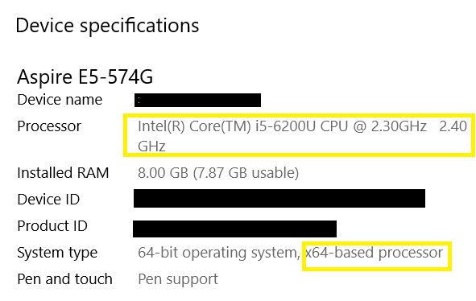

   If you have a 64-bit capable CPU, use the amd64 version (this works for Intel CPUs too). 
   If you have a 32-bit capable CPU, use the i386 version.

3. After it finishes downloading, open VirtualBox and click on `New` on the upper left-hand corner. Type `PFsense` into the `Name` box,
   select `BSD` from the `Type` dropdown menu, and select `FreeBSD (64-bit)` or `FreeBSD (32-bit)` based on your CPU. Then click `Next`.

   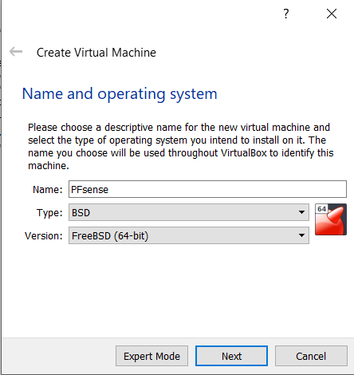

4. For RAM, I recommend at least 512 MB. If you are planning on creating videos or performing extensive work within PFsense, use the        default recommended 1024 MB. Click `Next`.

   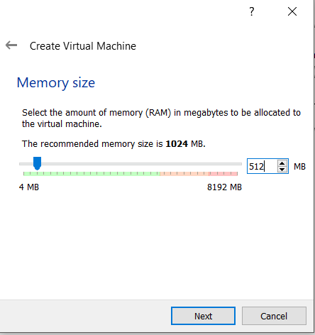

5. For the virtual hard disk, the minimum is 2 GB, but if you are running low on hard disk space, you could get by with 1 GB. If you are    planning on creating videos or performing extensive work within PFsense, select 6 GB. Here, I selected 4 GB to stay in the middle.

   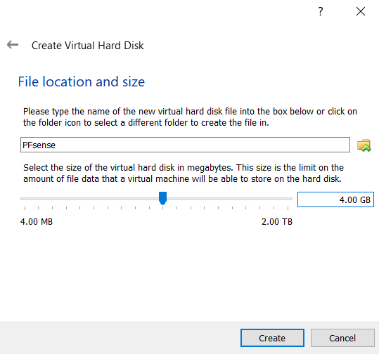

6. Because the PFsense file we downloaded earlier is in the gz file format and VirtualBox does not support gz files, we will need an        application that will be able to extract content (the ISO image file in our case, which VirtualBox does support) from gz files. In      this guide, we will be using WinRAR. 

   Open the PFsense.iso.gz file in WinRAR and then select `Extract To` at the top of the WinRAR screen. I chose to extract the contents to my `Downloads` folder. You can choose whichever folder you want.

   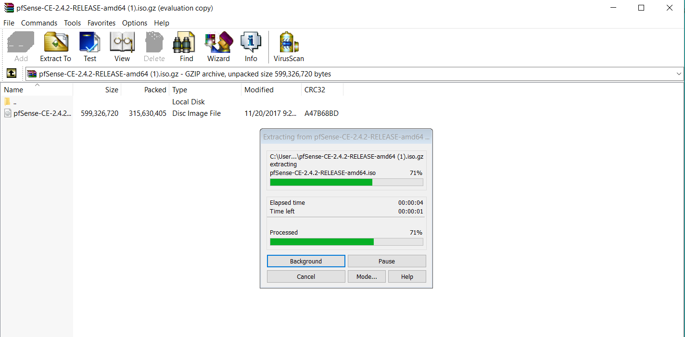
   
7. Now that we have the ISO image file, we can continue.

   Go back to VirtualBox. We will now place the PFsense ISO image file into VirtualBox so that our PFsense virtual machine will            recognize it and run PFsense.

   Go to `Settings` on the upper left-hand corner of the VirtualBox screen. Then click on the `Storage` tab. Click on `Empty` under the    `Controller: IDE` section. Then click on the disc image and select `Choose Virtual Optical Disk File...`

   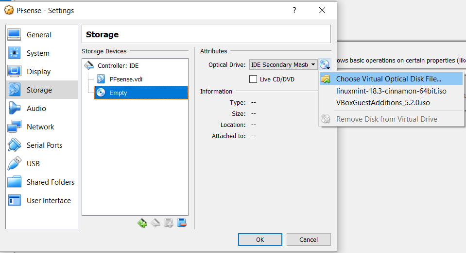

   Go to the location where you extracted the contents of the PFsense gz file to and select the PFsense ISO image file.

   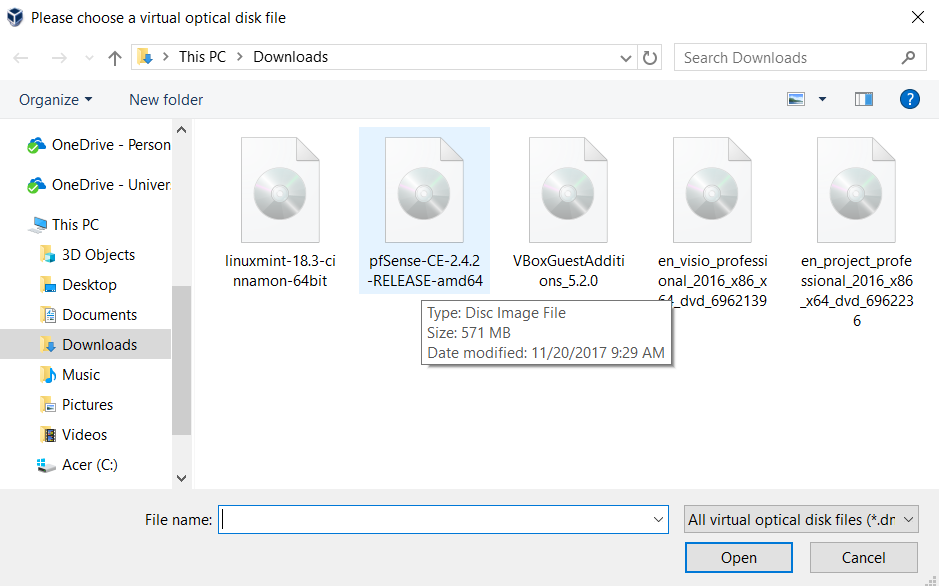

1. Associate the network adapters you [created from VirtualBox](https://goo.gl/vs4cHC) to PFsense.

   Go to PFsense `Settings` and select the `Network` tab.  For Adapter 1 tab, from the `Attached to` dropdown menu, set it to `Host-only adapter` and associate it with the LAN. Remember, if you are using VirtualBox in Windows, we are associating it with Network Card/Adapter 2. On Mac, we are associating it with Network Card/Adapter 0.

   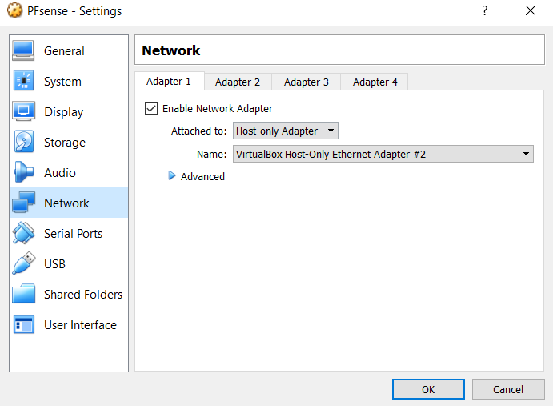

   For Adapter 2 tab, from the `Attached to` dropdown menu, select `Host-only adapter` and associate it with the DMZ. In Windows VirtualBox, it is Network Card/Adapter 3. On Mac, it is Network Card/Adapter 1.
   
   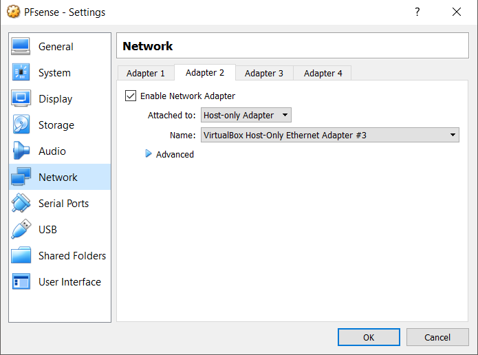
   
   For Adapter 3 tab, from the `Attached to` dropdown menu, select `Host-only adapter` and associate it with the WAN. In Windows VirtualBox, it is Network Card/Adapter 4. On Mac it is Netword Card/Adapter 2.
   
   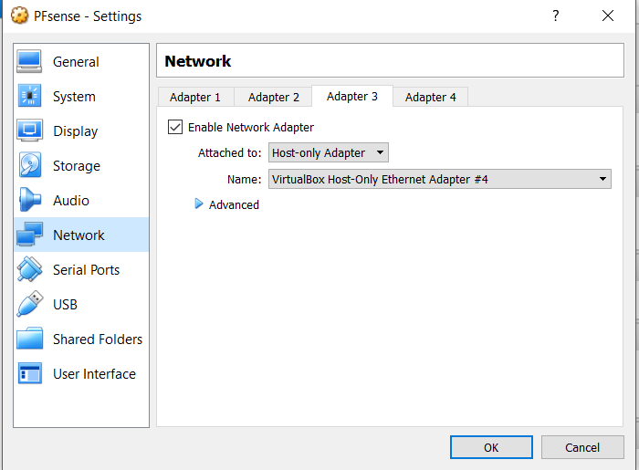
   
2. Now boot up PFsense by double-clicking on it from your VirtualBox homepage.

   You will be directed to a disclaimer page after PFsense autoboots. Hit `Enter` to accept.

   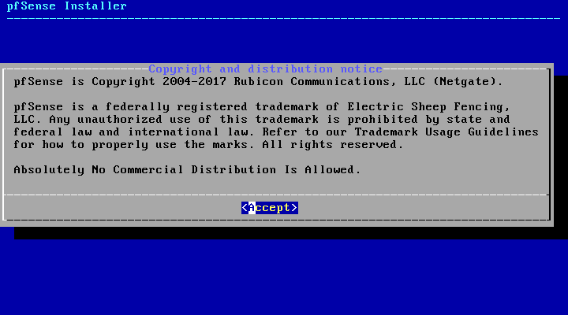
   
   You will be directed to the installer page. The default selection is `install pfSense`. Hit `Enter` to move forward.

   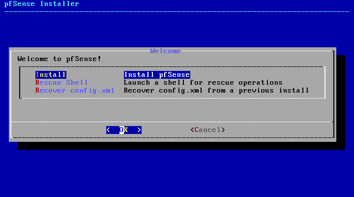
   
   Next step is to select filesystem. By default UFS is selected. This option automatically configures the hard drive. Hit `Enter` to continue. 
   
   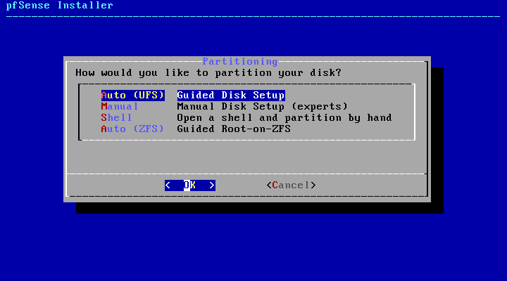
   
   Now you are on the keymap screen. The default is US standard keyboard map. Hit `Enter` to continue.
   
   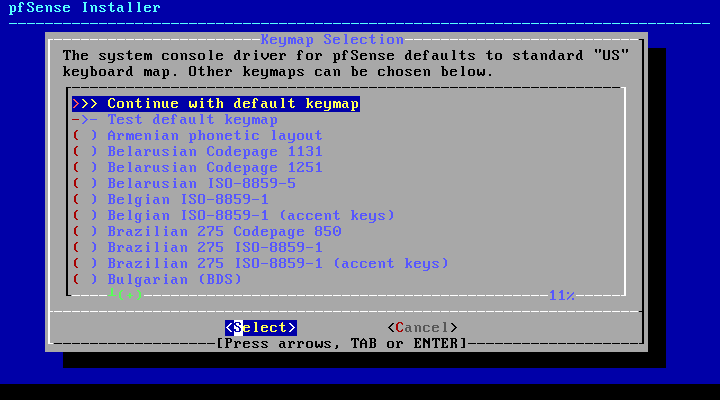
   
   Select `No` on the next screen when it asks you if you want to open the shell to make anymore manual configurations with the installation. Hit `Enter`.
   
   
   
   Select `Reboot` on the next screen and then hit `Enter`.

   
   
3. Take out the PFsense ISO image from the optical disk to avoid going through a loop.
   
   After PFsense finishes rebooting, you will be directed to the disclaimer page that you saw after starting up PFsense for the first time. The screens that follow will be the exact same and you'll end up in a loop. The reason for this is because this is the PFsense installer. We have finished installing PFsense and configured the installation from the defaults we selected. This is similar to when booting up a new operating system after inserting the CD into your computer's CD tray. Now, we have to take the "CD" out.
   
   PFsense needs to start from the hard disk. To do that, while PFsense is still running, click on the `Devices` tab at the top of the VirtualBox ribbon. Then select `Optical Drives` and `Remove disk from virtual drive`.
   
   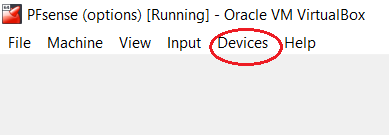
   
   Congrats! You finished installing PFsense into VirtualBox! Next, we will cover configuration.
   
## Configuring PFsense 

   
   Now that the PFsense installer is out, we can go back to VirtualBox and click on our PFsense VM. You will find that you are out of the loop now. Take note that your default login username is `admin` and your password is `pfsense`.
   
1. Assign the interfaces.

   On the welcome screen, you will see a list of options available. Type in `1` to choose `option 1`. We are assigning the network interfaces we created earlier into PFsense.
   
   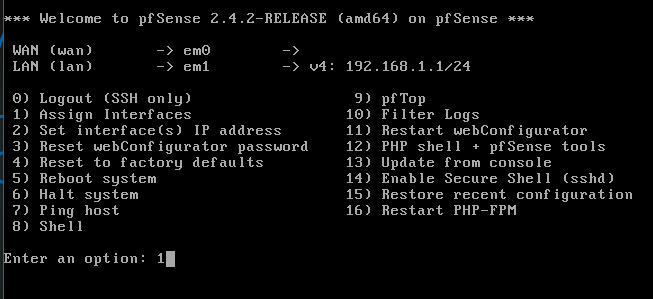
   
  A list of network interfaces will be shown: em0, em1, em2, and em3. These refer to the network adapters listed on the PFsense `Network` tab: Adapter 1, Adapter 2, and Adapter 3 respectively.
  
  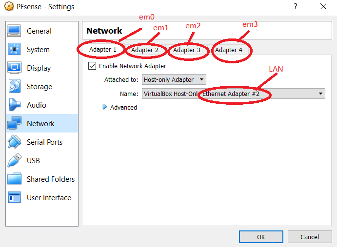
   
   When the screen asks, `Do VLANs need to be set up first?`, that is referring to setting up the virtual LAN. We have already done that in previous steps, so type `n` for 'no' and hit `Enter`.
   
   The first interface PFsense asks you to assign is the WAN. In previous steps we associated the WAN with Network Card/Adapter 4 (2 on Mac) under the PFsense Adapter 3 tab in VirtualBox. This tab basically refers to em2, so type `em2` and hit `Enter` to answer the question.
      
   The second interface PFsense asks you to assign is the LAN. In previous steps we associated the LAN with Network Card/Adapter 2  (0 on Mac) under the PFsense Adapter 1 tab in VirtualBox. This tab basically refers to em0, so type `em0` and hit `Enter` to answer the question.
   
   The third interface PFsense asks you to assign is an optional interface. Here, we have the DMZ that we setup earlier. We associated the DMZ with Netword Card/Adapter 2 (1 on Mac) under the PFsense Adapter 2 tab in VirtualBox. This tab basically refers to em1, so type `em1` and hit `Enter` to answer the question.
   
   The fourth interface PFsense asks you to assign is another optional interface. We don't have another one here, so just hit `Enter` to move on.
   
   Check the image below to be sure you have the following commands typed.
   
   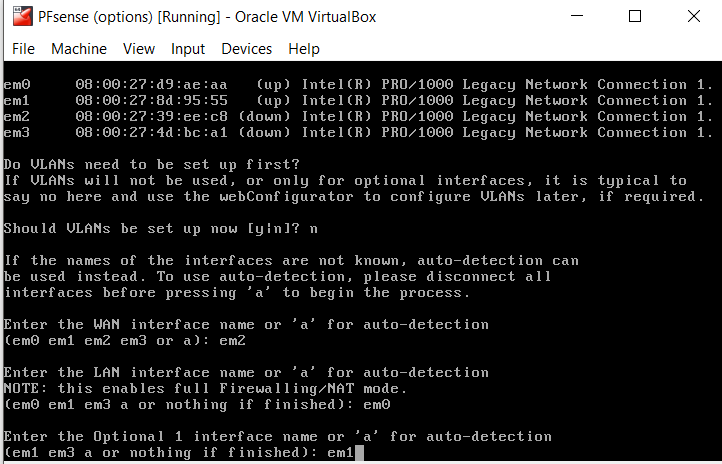

2. Set the interfaces' IP addresses

   When you return to the welcome screen, enter `2` to select option 2. Here, we will be setting the IP addresses of the interfaces we assigned within PFsense. You can set the IP address for whichever one you want to do first. The order doesn't matter. Let's start with the WAN. Type `1` to select WAN.

   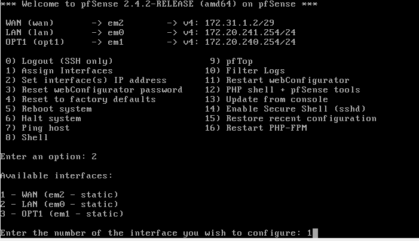
   
   When the screen asks for the IP address for the WAN, type `172.31.1.2`. When it asks for DHCP, type `n`.
   
   Make sure the following commands you type are the same as shown in the image below:
   
   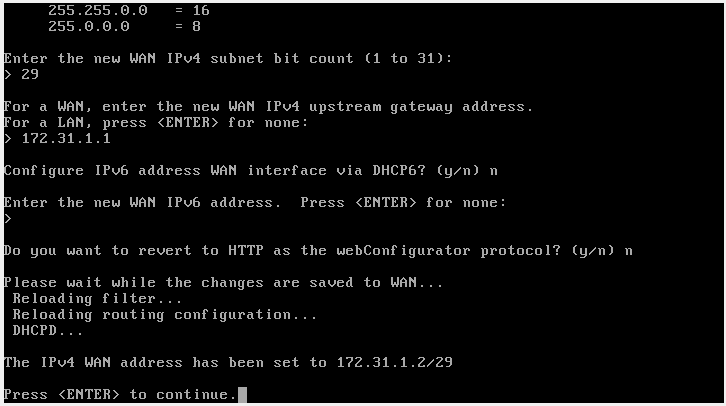
   
   Next, we will configure the LAN. When the screen asks for the IP address for the LAN, type `172.20.241.254`. Type `24` for its IPv4 submask. When it asks for DHCP, type `n`. Make sure the rest of your commands are as follows:
   
   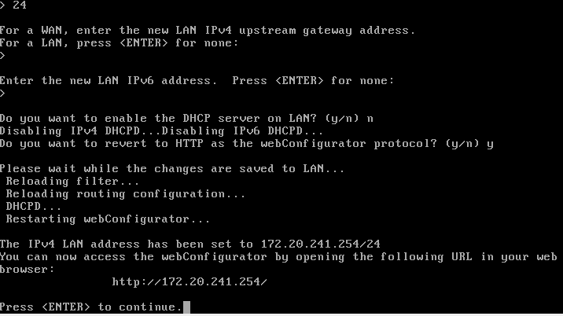
   
   Next, we will configure the DMZ. Type `172.20.240.254` for its IP address. Then Type `n` for DHCP. Make sure the rest of your commands are as follows:
   
   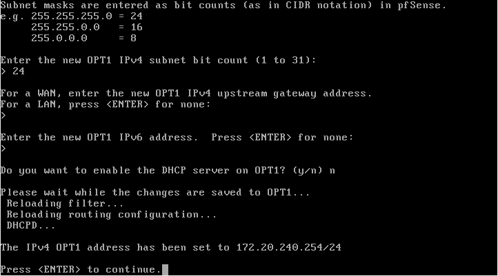
   
   Congrats! You have configured the PFsense VM! (on the command line)
   
   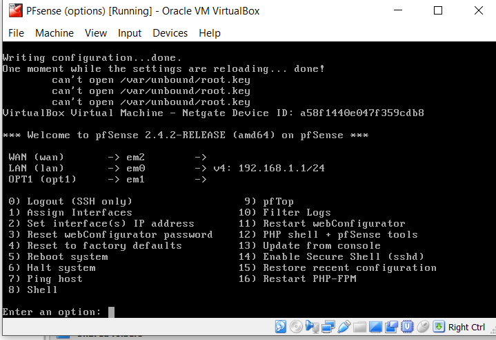
   
   Next, we will finish the PFsense configuration on the Windows 10 user interface. Reason being, the rest of the configuration steps will be much more difficult to do on the command line. Keep PFsense running and move onto the Windows 10 setup guide (coming soon). 
   
## Troubleshooting 

Make sure to have the network cards/adapters associated correctly. Same with em0, em1, and em2. Write down on paper if needed which network card/adapter goes under which PFsense adapter tab. If you make a mistake, use CTRL+C on the command line to redo a step. You might have to use your login info to perform actions. Remember that your default login username is `admin` and your password is `pfsense`.
