### Contact
- Slack: @Sharon on wcscusf.slack.com
- [LinkedIn](linkedin.com/in/sharon-tong)
- Email: sharont1@mail.usf.edu
### Table of Contents
1. [Prerequisites](#prereq)
2. [Summary](#summary)
3. [Installing pfSense](#installation)
4. [Configuring pfSense](#configuration)
5. [Setting Up and Configuring Windows 10](#windows10)
6. [Troubleshooting](#troubleshooting)

## Prerequisites 
1. Have your [virtual environment](https://www.virtualbox.org/wiki/Downloads) configured.
2. Have [WinRAR](https://www.win-rar.com/start.html?&L=0) installed on your computer.
3. Have your ISP gateway running (we'll be using [Ubuntu ISP](https://silexone.github.io/guides/nestor/ISPsetup.html) here).

## Summary 
pfSense is an open source firewall that is based on the FreeBSD operating system. Here, we will learn how to install and configure pfSense in a virtualization software, in this case, VirtualBox. We will also learn how to configure pfSense interfaces such as WAN and DMZ and firewall rules on a graphic user interface, in this case, Windows 10. We will then prepare to setup the DMZ interface to continue the goal of establishing a [virtual training network](https://silexone.github.io/).

## Installing pfSense 
1. Go to the pfSense download page [here](https://www.pfsense.org/download/).

2. Select the latest version of pfSense and the architecture you want based on the kind of CPU you have.
   
   To find out what kind of CPU you have, on Windows, go to the Start menu and type in `cpu`. A result should appear that tells            information about the processor. Select that and it will direct you to a screen with the CPU information.
 
   

   If you have a 64-bit capable CPU, use the amd64 version (this works for Intel CPUs too). 
   If you have a 32-bit capable CPU, use the i386 version.

3. After it finishes downloading, open VirtualBox and click on `New` on the upper left-hand corner. Type `pfsense` into the `Name` box,
   select `BSD` from the `Type` dropdown menu, and select `FreeBSD (64-bit)` or `FreeBSD (32-bit)` based on your CPU. Then click `Next`.

   

4. For RAM, I recommend at least 512 MB. If you are planning on creating videos or performing extensive work within pfSense, use the        default recommended 1024 MB. Click `Next`.

   

5. For the virtual hard disk, the minimum is 2 GB, but if you are running low on hard disk space, you could get by with 1 GB. If you are    planning on creating videos or performing extensive work within pfSense, select 6 GB. Here, I selected 4 GB to stay in the middle.

   

6. Because the pfSense file we downloaded earlier is in the gz file format and VirtualBox does not support gz files, we will need an        application that will be able to extract content (the ISO image file in our case, which VirtualBox does support) from gz files. In      this guide, we will be using WinRAR. 

   Open the pfSense.iso.gz file in WinRAR and then select `Extract To` at the top of the WinRAR screen. I chose to extract the contents to my `Downloads` folder. You can choose whichever folder you want.

   
   
7. Now that we have the ISO image file, we can continue.

   Go back to VirtualBox. We will now place the pfSense ISO image file into VirtualBox so that our pfSense virtual machine will recognize it and run pfSense.

   Go to `Settings` on the upper left-hand corner of the VirtualBox screen. Then click on the `Storage` tab. Click on `Empty` under the    `Controller: IDE` section. Then click on the disc image and select `Choose Virtual Optical Disk File...`

   

   Go to the location where you extracted the contents of the pfSense gz file to and select the pfSense ISO image file.

   

1. Associate the network adapters you [created from VirtualBox](https://goo.gl/vs4cHC) to pfSense.

   Go to pfSense `Settings` and select the `Network` tab.  For Adapter 1 tab, from the `Attached to` dropdown menu, set it to `Host-only adapter` and associate it with the LAN. Remember, if you are using VirtualBox in Windows, we are associating it with Network Card/Adapter 2. On Mac, we are associating it with Network Card/Adapter 0.

   

   For Adapter 2 tab, from the `Attached to` dropdown menu, select `Host-only adapter` and associate it with the DMZ. In Windows VirtualBox, it is Network Card/Adapter 3. On Mac, it is Network Card/Adapter 1.
   
   
   
   For Adapter 3 tab, from the `Attached to` dropdown menu, select `Host-only adapter` and associate it with the WAN. In Windows VirtualBox, it is Network Card/Adapter 4. On Mac it is Netword Card/Adapter 2.
   
   
   
2. Now boot up pfSense by double-clicking on it from your VirtualBox homepage.

   You will be directed to a disclaimer page after pfSense autoboots. Hit `Enter` to accept.

   
   
   You will be directed to the installer page. The default selection is `install pfSense`. Hit `Enter` to move forward.

   
   
   Next step is to select filesystem. By default UFS is selected. This option automatically configures the hard drive. Hit `Enter` to continue. 
   
   
   
   Now you are on the keymap screen. The default is US standard keyboard map. Hit `Enter` to continue.
   
   
   
   Select `No` on the next screen when it asks you if you want to open the shell to make anymore manual configurations with the installation. Hit `Enter`.
   
   
   
   Select `Reboot` on the next screen and then hit `Enter`.

   
   
3. Take out the pfSense ISO image from the optical disk to avoid going through a loop.
   
   After pfSense finishes rebooting, you will be directed to the disclaimer page that you saw after starting up pfSense for the first time. The screens that follow will be the exact same and you'll end up in a loop. The reason for this is because this is the pfSense installer. We have finished installing pfSense and configured the installation from the defaults we selected. This is similar to when booting up a new operating system after inserting the CD into your computer's CD tray. Now, we have to take the "CD" out.
   
   pfSense needs to start from the hard disk. To do that, while pfSense is still running, click on the `Devices` tab at the top of the VirtualBox ribbon. Then select `Optical Drives` and `Remove disk from virtual drive`.
   
   
   
   Congrats! You finished installing pfSense into VirtualBox! Next, we will cover configuration.
   
## Configuring pfSense 

   
   Now that the pfSense installer is out, we can go back to VirtualBox and click on our pfSense VM. You will find that you are out of the loop now. Take note that your default login username is `admin` and your password is `pfsense`.
   
1.	Assign the interfaces.

   On the welcome screen, you will see a list of options available. Type in `1` to choose `option 1`. We are assigning the network interfaces we created earlier into pfSense.
   
   
   
  A list of network interfaces will be shown: em0, em1, em2, and em3. These refer to the network adapters listed on the pfSense `Network` tab: Adapter 1, Adapter 2, and Adapter 3 respectively.
  
  
   
   When the screen asks, `Do VLANs need to be set up first?`, type `n` for 'no' and hit `Enter`.

NOTE: VLANs stand for Virtual Local Area Networks. They allow 1 network card to serve multiple subnets, which in our context, means to connect both a LAN and a WAN to a router. We already created our 3 network cards early on for our LAN, WAN, and DMZ, so that's why we don't need them here.

   Assign the following when prompted:
   
   		WAN = em2
		LAN = em0
		DMZ = em1
   
   Check the image below to be sure you have the following commands typed.
   
   

2. 	Set the interfaces' IP addresses

	When you return to the welcome screen, enter `2` to select option 2. Here, we will be setting the IP addresses of the interfaces we assigned within pfSense. You can set the IP address for whichever one you want to do first. The order doesn't matter. Let's start with the WAN. Type `1` to select WAN.

	
	
	When the screen asks for the IP address for the WAN, type `172.31.1.2`. When it asks for DHCP, type `n`.
	
	Make sure the following commands you type are the same as shown in the image below:
	
	
	
	Next, we will configure the LAN. When the screen asks for the IP address for the LAN, type `172.20.241.254`. Type `24` for its IPv4 submask. When it asks for DHCP, type `n`. Make sure the rest of your commands are as follows:
	
	
	
	You should end up with the LAN and WAN like the image below. If so, congrats! You have configured the pfSense VM! (on the command line)
	
	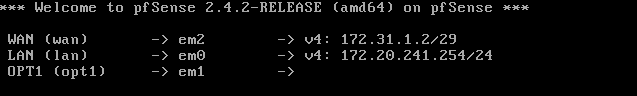
	
	Next, we will finish the pfSense configuration on the Windows 10 user interface. Reason being, the rest of the configuration steps will be much more difficult to do on the command line. Make sure to keep pfSense running (or some of the following steps won't work) and we will move onto configuring Windows 10.

## Setting Up and Configuring Windows 10 

1.	Download Windows 10 from this [link](https://www.microsoft.com/en-us/evalcenter/).

2.	On VirtualBox, go to Windows 10 VM Settings and change the Network to `Host-Only` Network Card 2, which is our LAN.

3.	Start up Windows 10 and choose all the default settings on each prompt. 

4.	We are going to change the Windows 10 IP address. When 	you arrive at the Windows 10 desktop screen, select 	`PC Settings` from the Start menu. Then click `Network 	& Internet`, then `Change adapter options`, then 	right-click `Ethernet` and select `Properties`. Scroll 	down to `Internet Protocol Version 4 (TCP/IPv4)` and 	click on the `Properties` button associated with it.

	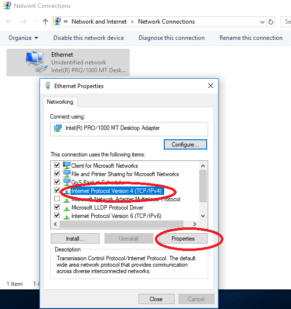

	Make sure you have the following typed in:

	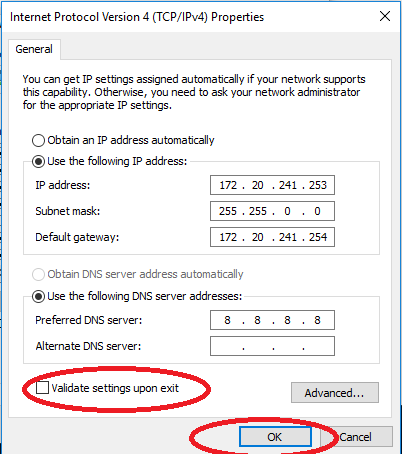

5.	Verify connectivity then login into pfSense at `https://172.20.241.254`
	
	There will be a security warning page, just click on `Details` and then `Go on to the webpage`.

	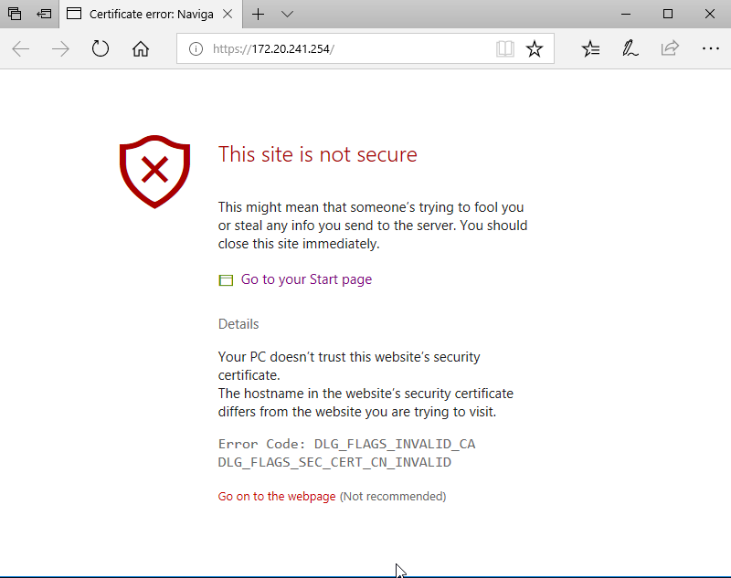

	Use `admin` for username and `pfsense` for password.

	There may be an accept conditions notice upon arriving at the webpage. Click `Accept`.

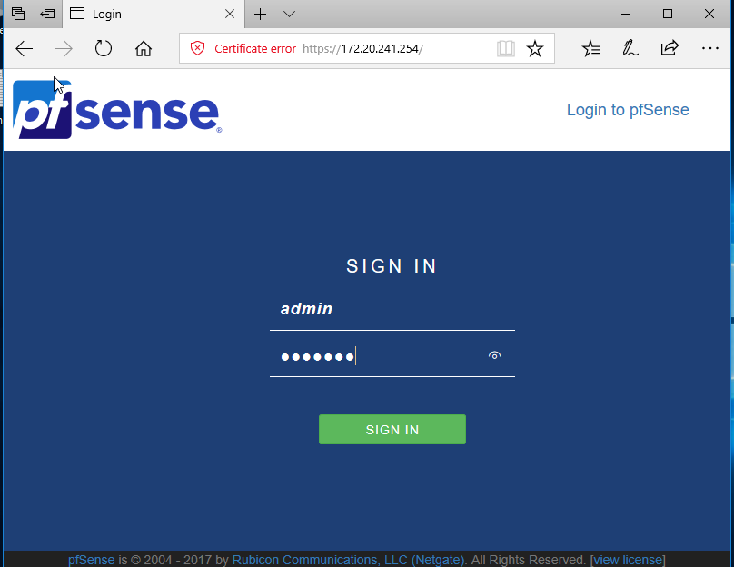

6.	We are going to configure our DMZ settings. Go to the 	`Interfaces` tab on the pfSense webpage and click on 	`OPT1`.

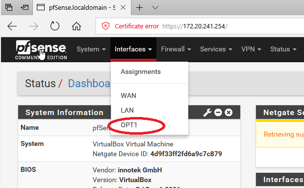

We are going to enable DMZ by checking the `Enable interface` box, change the name of OPT1 to `DMZ` in the `Description`, and assign a static IPv4 address to the DMZ :`172.20.240.254` with subnet `/32`. Make sure you have the following settings exactly as shown in the next 2 images. Click on the `Save` button to save all these changes.

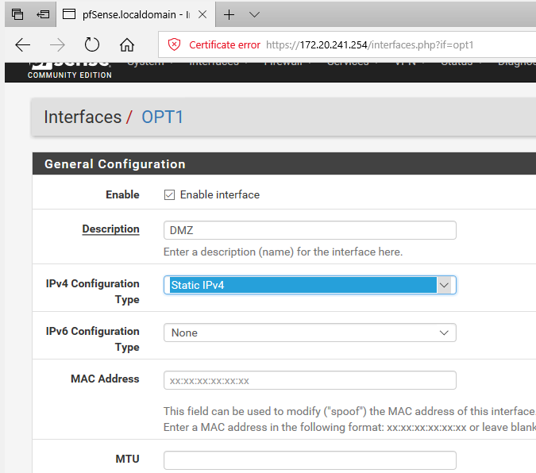

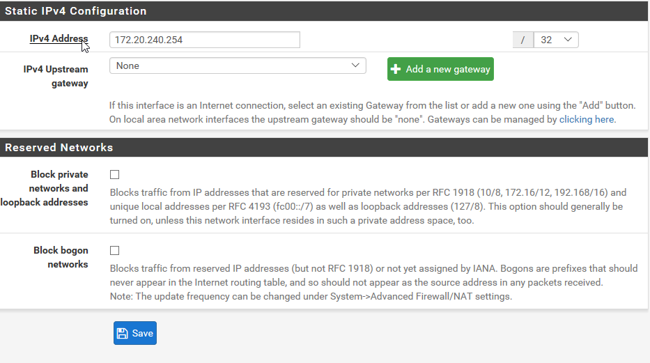

Now apply the DMZ setting changes by clicking `Apply Changes`.

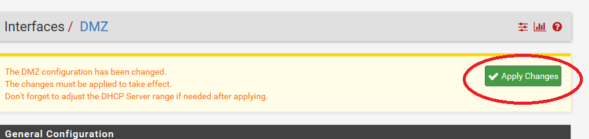

7.	Next, we are going to configure our WAN settings. Go back to the `Interfaces` tab and select `WAN`. 

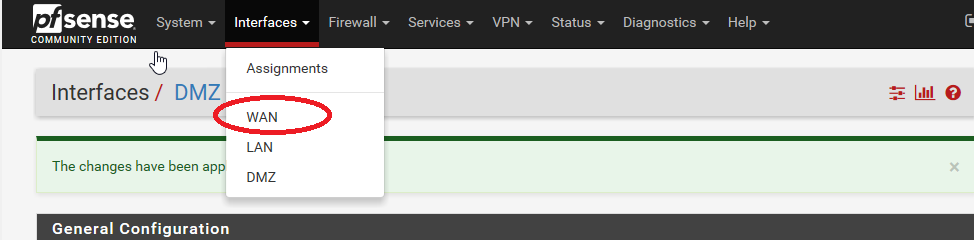

We are just going to `Deselect` all the `Reserved Networks` options. Then click `Save` and `Apply Changes`.

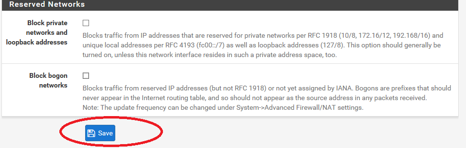

8.	Now we are going to setup our firewall rules. Go to the `Firewall` tab and select `Rules`.

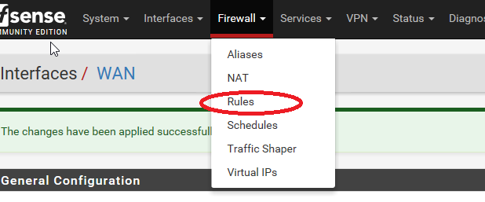

We are going to allow WAN access by letting `Action` be  set to `Pass` and `Interface` be set to `WAN`. By default, the pfSense firewall blocks all WAN access. Change `Protocol` to be set to `Any` and `Source` to `Single host or alias`. Type in the address `172.31.1.3` for the source. Save and apply these changes.

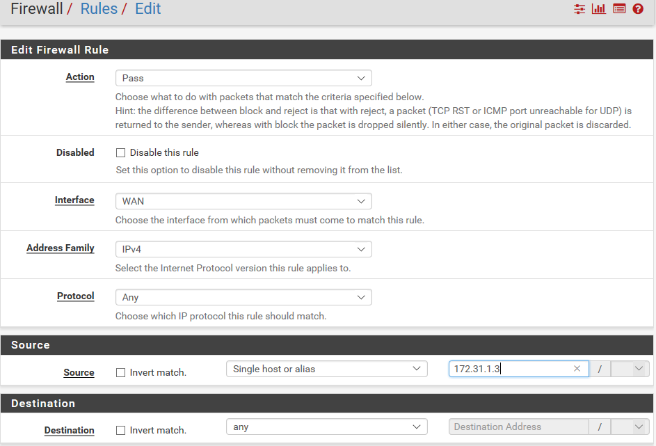

Our next firewall rule will be to allow DMZ access.

Go back to the `Firewall` tab and click on `Rules`. Go to `LAN`. Then set `Action` to `Pass`, `Interface` to `DMZ`, `Protocol` to `Any`, `Source` to `Any`, and `Destination` to `Any`. Save and apply these changes.

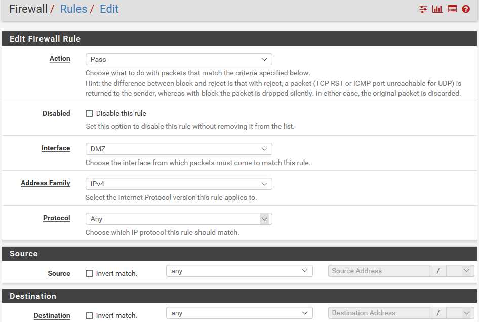

We have finished setting up firewall rules. We will now finish the Windows 10 setup by making Windows 10 be the WAN.

9.	Set the Windows 10 Network to Host-Only WAN by going to the Windows 10 VM settings and clicking on `Network`. Then under the Adapter 1 tab, change `Attached to` to `Host-Only` and the `Name` to the one with `Adapter #4` (2 on Mac), our WAN adapter. 

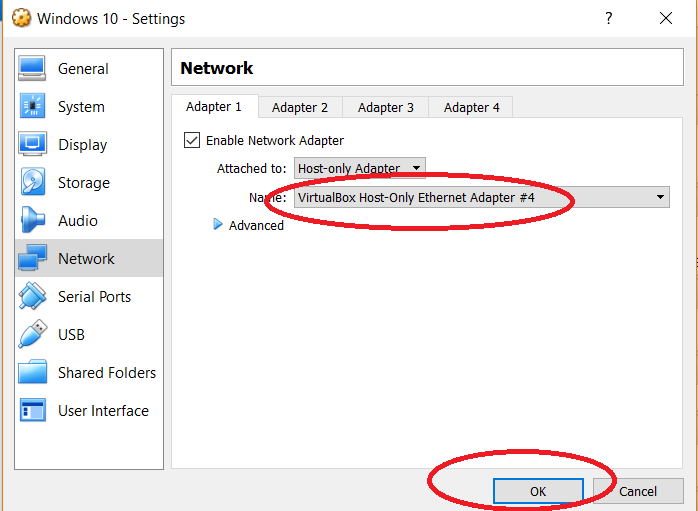

10.	Finally, on the Windows 10 desktop, go back to the Windows IPv4 Properties from the Network Sharing Center. Use the following addresses:

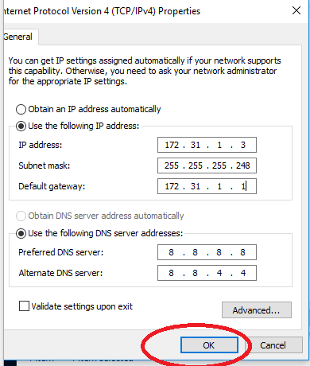

So far, this is our current network setup.

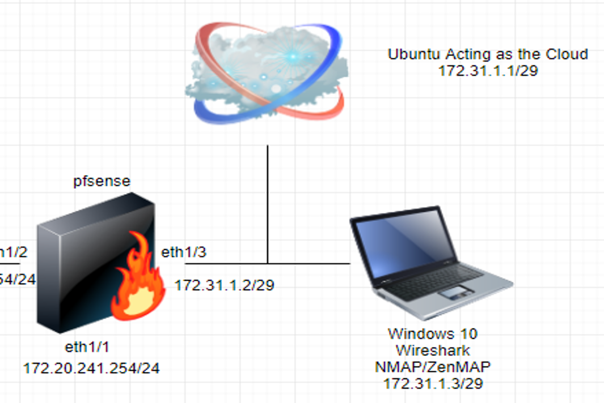

We are missing the DMZ interface. In the next guide (coming soon), we will setup DMZ Ubuntu.

## Troubleshooting 

Make sure to have the network cards associated correctly. Same with em0, em1, and em2. Write down on paper if needed which network card goes under which pfSense adapter tab. If you make a mistake, use CTRL+C on the command line to redo a step. You might have to use your login info to perform actions. Remember that your default login username is `admin` and your password is `pfsense`. 

Also, when you are trying to use the Internet on the Windows 10 VM, even if the network icon at the bottom of the Windows 10 screen says there's no Internet, just type in  the `https://172.20.241.254` address anyway to really confirm.
