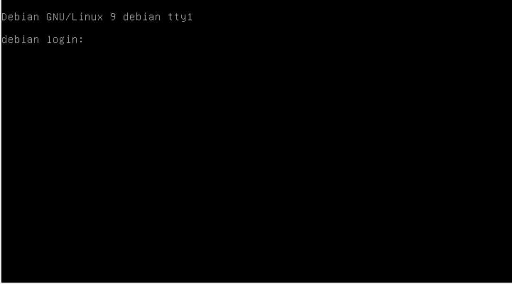
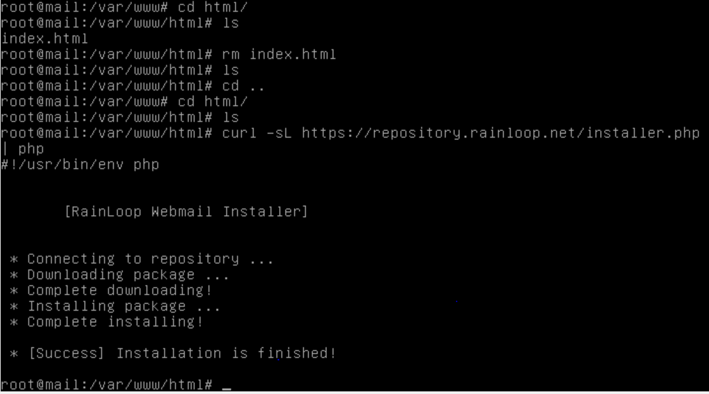
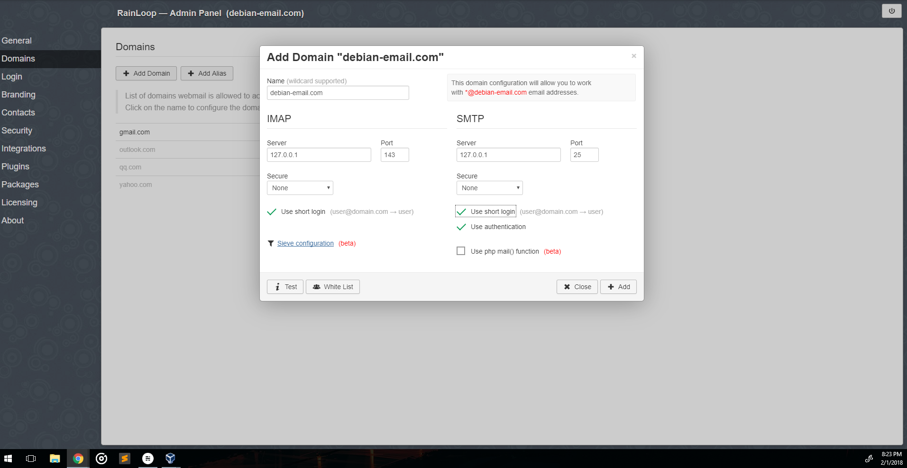

# Debian Email Box

## Summary 
This is the setup guide for the Debian Email box. We will be using a Postfix, dovecot, and webmail setup.

### Contact
- Twitter: @Dubliyu
- Slack: @yourlocalgod on wcscusf.slack.com
- Email: [Gmail](mailto:cleonromero@mgail.com)

### Table
1. [Prerequisites](#pre-reqs)
2. [Setup Debian VM](#setup-vm)
3. [Install Postfix](#postfix)
4. [Install Dovecot](#dovecot)
5. [Install Webmail](#webmail)
6. [Testing](#testing)

<a id="pre-reqs"></a>
## Prerequisites 
1. Have your [virtual environment](https://silexone.github.io/guides/nestor/ISPsetup.html) configured
2. Have the [ISP](https://silexone.github.io/guides/nestor/ISPsetup.html) gateway running.
3. Have pfSense running.


<br>

<a id="setup-vm"></a>
## Setup Debian VM 
1. First, go get the Debian server from ISO [here](https://cdimage.debian.org/debian-cd/current/amd64/iso-cd/debian-9.3.0-amd64-netinst.iso). 
    Then, open up VirtualBox, create a new Linux Debian (64-bit) VM, the default setting will do. Then alter the network settings to use Host-only adapter instead of NAT. Insert the downloaded ISO into the virtual optical drive and boot.
   
2. Select options as follows in the installation (pretty much a standard setup)
    1. Choose Graphical install
    2. English
    3. United States
    4. American English
    5. "debian"
    6. "debian-email.com"
    7. {super secret password}
    8. {some user}
    9. {some user password}
    10. Eastern
    11. Guided - sue entire disk
    12. All files in one partition
    13. Finish partitioning
    14. Yes - write to file
    15. No
    16. United States
    17. ftp.us.debian.org
    18. No - no popularity contest
    19. For software selection pick only: standard system utilities
    20. Yes - to grub
    21. /dev/sda - should be the only disk
4. Now you should see a terminal login prompt. Login.

<br>

<a id="postfix"></a>
## Install Postfix 
Here we will install Postfix.

1. Preperations

    First become superuser and fetch updates
    ``` bash
    su
    # Enter the {super secret password}
    apt-get update
    apt-get upgrade
    ```
    
    Now install some packages that will be useful later
    ```bash
    apt-get install -y net-tools wget curl
    ```
    
    Now open up /etc/host.conf file with `vi` configure it so it looks like so.
    ```bash
    order hosts, bind
    multi on
    ```
    
    Now we add our ip and domain name 'debian-email.com' to the host file so it will internally resolve. Make sure someone on the DNS server has debian-email.com point to this box - or add it manually to each windows/linux host file.
    
    First, get the IP by running `ifconfig` . The info we want will appear like so  `inet 10.0.2.15` . Now run these two commands, use your IP instead of 10.0.2.15
    ```bash
    hostnamectl set-hostname mail.debian-email.com
    echo "10.0.2.15" debian-email.com mail.debian-email.com >> /etc/hosts
    ```
    
    Now reboot: `reboot` . Then become superuser again

2.
    Install postfix
    
    ``` bash
    apt-get install -y postfix
    # A graphical-esc inerface pops up
    # For Mail Configuration: Internet Site
    # Our mail name will be: "debian-email.com"
    ```
3. No we need to make some adjustments to the postfix configuration
    
    Go to `/etc/postfix` and edit the `main.cf` file with `vi`
    ```bash
    # Find the line that reads myhostname= and change to
    myhostname=mail.debian-email.com
    
    # Add the following line
    mydomain=debian-email.com
    home_mailbox = Maildir/
    smtpd_sasl_type = dovecot
    smtpd_sasl_path = private/auth
    smtpd_sasl_auth_enable = yes
    smtpd_sasl_security_options = noanonymous
    smtpd_sasl_local_domain = $myhostname
    smtpd_recipient_restrictions = permit_mynetworks,permit_auth_destination,permit_sasl_authenticated,reject
    ```
    
    Run `postconf -n` and check there where no misspellings
    
    Then restart postfix service
    ```bash
    systemctl restart postfix
    ```
    
    
4. verify that postfix is listening on port 25
    
    Run `netstat -ant` . We are looking for two rows that reads
     ```bash
     tcp    0    0   0.0.0.0:25    0.0.0.0:*    LISTEN
     tcp6   0    0   :::25         :::*         LISTEN
     ``` 

<br>

<a id="dovecot"></a>
## Install Dovecot 
Here we will install Dovecot.
 
1. install dovecot core and dovecot IMAP so that mail can be retrieved using the IMAP protocol.
    ``` bash
    apt-get install -y dovecot-core dovecot-imapd
    ```
2. Go to `/etc/dovecot` we need to make some small configuration changes
    
    Edit the `dovecot.conf` file with `vi`
    
    ```bash
    # Near the bottom of the file, find this line and uncomment it
    listen =*, ::
    ```
    
    Next edit the `./conf.d/10-auth.conf` file with `vi`.
    ```bash
    #  set as follow
    disable_plaintext_auth = no
    auth_mechanisms = plain login
    ```
    
    Next edit the `./conf.d/10-mail.conf` file with `vi`.
    ```bash
    #  set as follow
    mail_location = maildir:~/Maildir
    ```
    
    Next edit the `./conf.d/10-master.conf` file with `vi`.
    ```bash
    # Look for the commented section Postfix smpt-auth
    # uncomment what is there and add so it looks like... 
    # Postfix smtp-auth
        unix_listener /var/spool/postfix/private/auth {
        mode = 0666
        user = postfix
        group = postfix
    }
    ```
    
    Finally restart dovecot
    ```bash
       systemctl restart dovecot
    ```
3. Verify that Dovecot is listening on the right ports by running `netstat - ant` again
    ```bash
        tcp    0    0   0.0.0.0:143    0.0.0.0:*    LISTEN
        tcp6   0    0   :::143         :::*         LISTEN
    ``` 

4. Lastly, add a Maildir for every user
    ```bash
    echo "export MAIL=$HOME/Maildir" >> /etc/profile
    mkdir -p /etc/skel/Maildir/{cur,new,tmp}
    ```

<br>

<a id="webmail"></a>
## Install Webmail
This will provide a GUI users can use to see their mail

1. First we install the dependencies
    ``` bash
    apt-get install -y php7.0 libapache2-mod-php7.0 php7.0-curl php7.0-xml
    ```
2. Install webmail
    
    First go to `/var/www/html` and delete the `index.html` file with `rm`
    Next download the webmail installer
    ```bash
    curl -sL https://repository.rainloop.net/installer.php | php
    # Then you should see this after a bit...
    ```
    
3. Access this box via the web

    Assuming DNS has been setup to redirect debian-email.com to its IP, if not add the redirect your hosts file on linux/windows, or just use the IP. In any case go to http://debian-email.com/?admin  or  http://10.0.2.5/?admin
    
    When you get there you will see a login page, login with...
    ```
    User: admin
    Password: 12345
    ```
    Go to Domains > add
    ```
    Imap
    ------
    Server: 127.0.0.1
    Port: 143
    Secure: None
    Use short Login: yes
    
    SMTP
    ------
    Server: 127.0.0.1
    Port: 25
    Secure: None
    Use short Login: yes
    Use authentication: yes
    ```
    
    
<br>
    
<a id="testing"></a>
## Testing 
Lets make sure everything works

1. Users

    Every user on the box should have a Maildir folder
    To test this, add a new user. The -m means create a folder in home for them.
    ```bash
    useradd -m jeff
    passwd jeff
    # We should see a Maildir folder exists
    ls /home/jeff
    # We should see a cur, new and temp folder exists
    ls /home/jeff/Maildir
    ```
    
2. SMTP
    
    If everything went right, SMTP should be working.
    To test that out install `mailutils`
    ```bash
    apt-get install -y mailutils
    # Now execute these commands
    echo "TEST EMAIL" | mail -s "testmail" jeff
    mailq
    mail
    ```
    
    Now `cat` out the contents of `jeff` user `Maildir/new` folder content
    ```
    # use tab autocomplete here since the file name will be long
    cat /home/jeff/Maildir/new/[tab]
    # Expect something like
    
    Return-path: <root@mail.debian-email.com>
    X-Original-To: jeff@mail.debian-email.com
    Delivered-To: jeff@mail.debian-email.com
    Received: by mail.debian-email.com (Postfix, from userid 0)
            id A981141DF1; Thu,   1 Feb 2018 20:50:14 -0500 (EST)
    Subject: testmail
    To: <jeff@mail.debian-email.com>
    X-Mailer: mail (GNU Mailutils 3.1.1)
    Message-Id: <214324242342342342.A981141DF1@mail.debian-email.com>
    Date: Thu,   1 Feb 2018 20:50:14 -0500 (EST)
    From: root@mail.debian-email.com (root)
    
    TEST EMAIL
    ```
3. Webmail

    Use the user we created and log in to webmail
    ```
    login
    -----
    jeff@debian-email.com
    password
    ```
    
    Confirm that you can indeed login.
    From here you should be able to see you inbox with has the mail we sent from earlier.
    
<small>Photo by [Lauren Mancke](https://unsplash.com/@laurenmancke?utm_source=ghost&utm_medium=referral&utm_campaign=api-credit) / [Unsplash](https://unsplash.com/?utm_source=ghost&utm_medium=referral&utm_campaign=api-credit)</small>